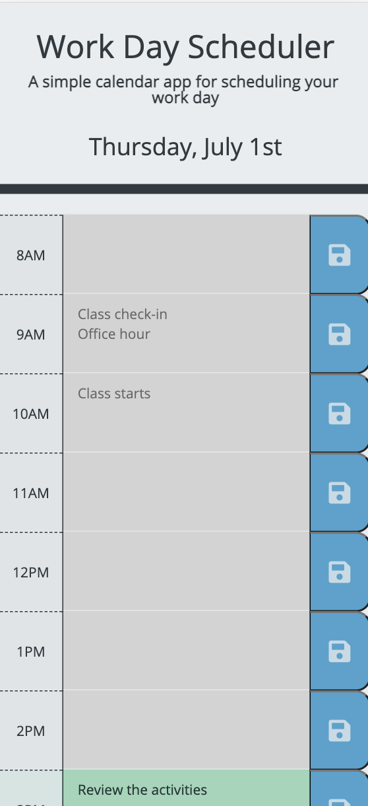

# Work-Day-Scheduler
This project is to create simple daily planner that allows users to add important events to it and manage their time effectively

## Getting Started
```console
git clone https://github.com/qtian13/Work-Day-Scheduler.git
```

## Built With
* [HTML](https://developer.mozilla.org/en-US/docs/Web/HTML)
* [CSS](https://developer.mozilla.org/en-US/docs/Web/CSS)
* [Bootstrap](https://stackpath.bootstrapcdn.com/bootstrap/4.3.1/css/bootstrap.min.css)
* [JavaScript](https://www.javascript.com/)
* [jQuery](https://cdnjs.cloudflare.com/ajax/libs/jquery/3.2.1/jquery.min.js)

## Description of the Work Day Scheduler
1. There are two main parts in the page: a jumbotron header and timeblocks from 8am to 5pm
    * each timeblock is color coded to indicate whether it is in the past, present, or future.
    * Users can enter an event when they click into a timeblock. The color of text area changes when focused.
    * The event entered would be saved in the `Local Storage` with a click on save button for the timeblock. The icon become larger when a mouse hover over it.
    * Saved events persist when page refreshed.

## Page URL
https://qtian13.github.io/Work-Day-Scheduler/

## Page Demo


## Page Screen Shot with Different Screen Width




## Author
Qiushuang Tian
- [Link to Portfolio Site](https://qtian13.github.io/)
- [Link to Github](https://github.com/qtian13)
- [Link to LinkedIn](https://www.linkedin.com/in/qiushuang-tian-a9754248/)

## Acknowledgments
- [Berkeley Coding Boot Camp](https://bootcamp.berkeley.edu/coding/) provided start code